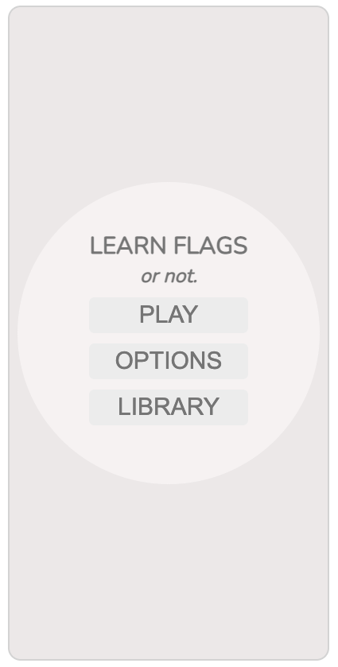
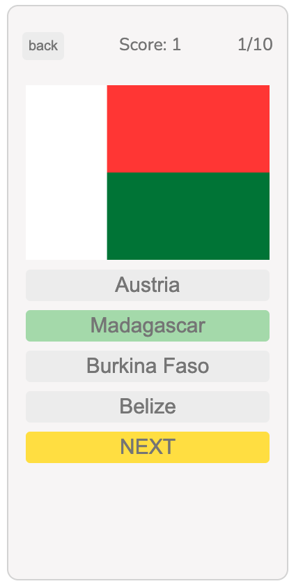
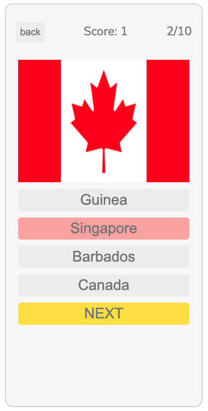
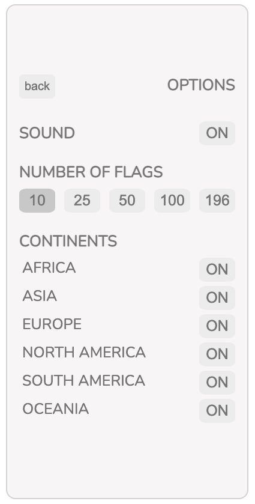
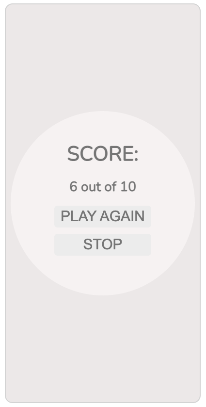

<h1>LEARN FLAGS APP V.1</h1>
<h5>SEI 48 Project I<h5>

Thank you for checking out my project! I designed this calm flag-trivia-game for late night scrollers attempting to familiarize themselves with flags from countries around the world. The app presents itself in a monocromatic tone attempting to be as minimalist as possible, but the flags, correct and incorrect button highlights and 'Next' buttons have color. Also the app starts with a default of 10 flags and sound option, which can be turned off in the options panel. Time of completion: 7 days.

# Features:

- Desktop and Mobile compatible.
- 196 country flags selected but no territories for V.1.
- Options for playing with 10, 25, 50, 100 and 196 flags.
- At the end of the game the app will display correct vs total flags for the game.
- Sound options.

# Next Steps:

- Library: List of flags and names of the countries they belong for additional study.
- Every time an incorrect answer is chosen it highlights red, but soon the correct will also be highlighted in the color green. This will allow the user to learn which flag was the correct one.
- Add and remove continents from the options menu.
- Fix end of screen bug and double option print issue.

# Technologies Used

- Java Script
- HTML
- CSS
- Adobe Illustrator

# You can test this game by clicking [**HERE**](https://jp4441.github.io/GA_Project_1_Flag_Game/)

# Images

|        Main Screen        |        Play Screen        |
| :-----------------------: | :-----------------------: |
|  |  |

|          Correct Answer          |          Wrong Answer          |
| :------------------------------: | :----------------------------: |
|  |  |

|        Options Screen        |         End Game Screen         |
| :--------------------------: | :-----------------------------: |
|  |  |
