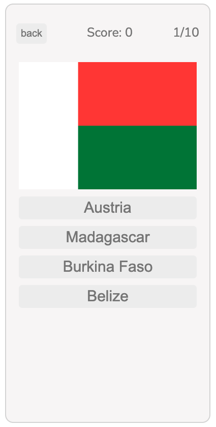

 
<h1 align="center"># LEARN FLAGS - or not -- V.1</h1>

# LEARN FLAGS - or not -- V.1

A simple game displaying flag from countries around the world. Game displays 1 flag and provides 4 options to choose from.

# Features:

- Desktop and Mobile compatible
- 196 countries selected - no territories for V.1.
- Options menu allowing user to pick the amount of flags user wants to play with - 10 flags is the default.
- Default sounds for correct and wrong answer which can be turned off from options menu.
- At the end of the game - i.e when 10 attempts have reached 10 flags, the game will end and will display score.

# Next Steps:

- Library of flags and names of the countries they belong to
- Feature where everytime you get a flag choice wrong the correct answer will display as well
- Add and remove continents from the options menu.
- Fix end of screen bug and double option print issue

# Technologies Used

- Java Script
- HTML
- CSS

# Play the game [**HERE**](https://jp4441.github.io/GA_Project_1_Flag_Game/)

# Images

|        Main Screen        |        Play Screen        |
| :-----------------------: | :-----------------------: |
|  |  |

|          Correct Answer          |          Wrong Answer          |
| :------------------------------: | :----------------------------: |
|  |  |

|        Options Screen        |         End Game Screen         |
| :--------------------------: | :-----------------------------: |
|  |  |
